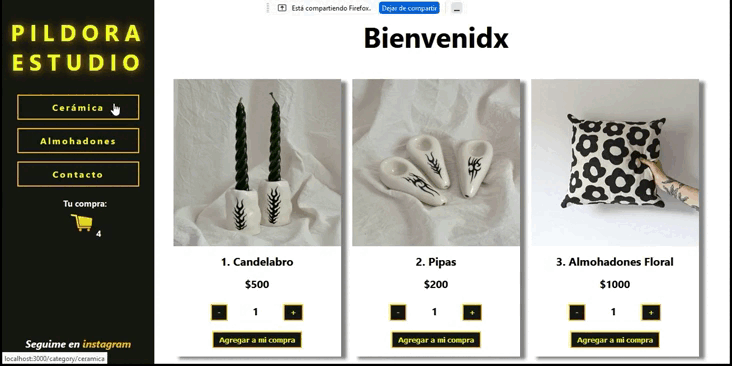

# Pildora Etudio - Proyecto de e-commerce

Para poder inicializar este proyecto deberas:
- Clonarlo utilizando el comando '$git clone PONER URL'
- Hacer el correspondiente 'npm install' en la consola 
- Y para visualizar el proyecto usamos el comando 'npm start'. Podras ver el procto en http://localhost:3000

## Explicación de mi lógica
- En el archivo API.js se encuentran los métodos que utilizo para hacer solicitudes a la BD. Casi toda la lógica ligada a Firestore usada en este proyecto intenté unificarla en este archivo.
- Dentro de la carpeta 'Hook' se encuentran los diferentes customesHooks que creé según encontré conveniente para simplificar el código o delegar tareas.

## Rutas

- El index de la aplicación muestra el componente <ItemListContainer> donde se visualiza la totalidad de los productos en stock
- La ruta '/category/:category' nos muestra también el componente <ItemListContainer> pero con los productos filtrados según la opción que hayas clickeado en la NavBar
- La ruta '/contacto' tiene un formulario de contacto pero aún no tiene lógica propia para poder recibir esa información ingresada por el usuario en un mail.
- La ruta '/miscompras' muestra un formulario donde el usuario puede poner el número de orden y le devuelve información sobre el/los producto/s comprados.
- La ruta '/detail/:productID' muestra el componente <ItemDetailContainer> se accede al seleccionar uno de los productos y muestra mas detalles del mismo
- La ruta '/cart' muestra una tabla donde se listan los productos que el usuario elije previo a la confirmación de la compra.
- La ruta '/formPurchase' corresponde al formulario donde el usuario ingresa sus datos personales y donde al hacer click genera la orden de compra efectivamente.

## Variables de entorno
Para que el proyecto funcione correctamente es necesario conectarlo a variables de entorno de firebase/firestore.
Podes ver [env.example](https://github.com/Jxxlian/pildora_estudio/blob/PildoraFinal/.env.example) como ejemplo.

 ## Test App

 ## Vista previa al proyecto

